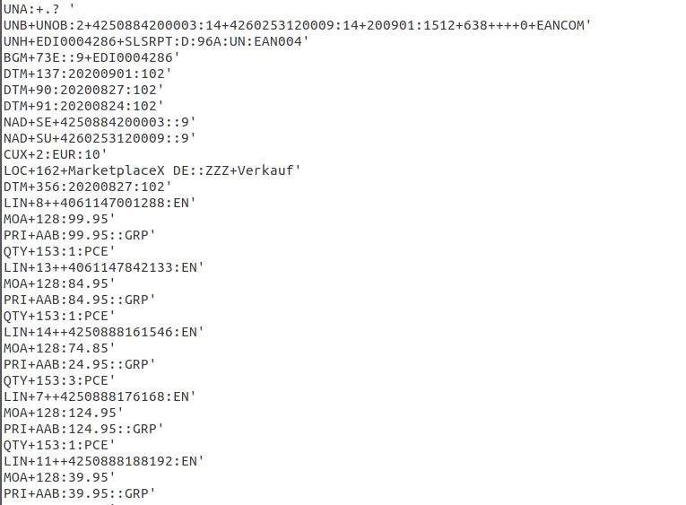
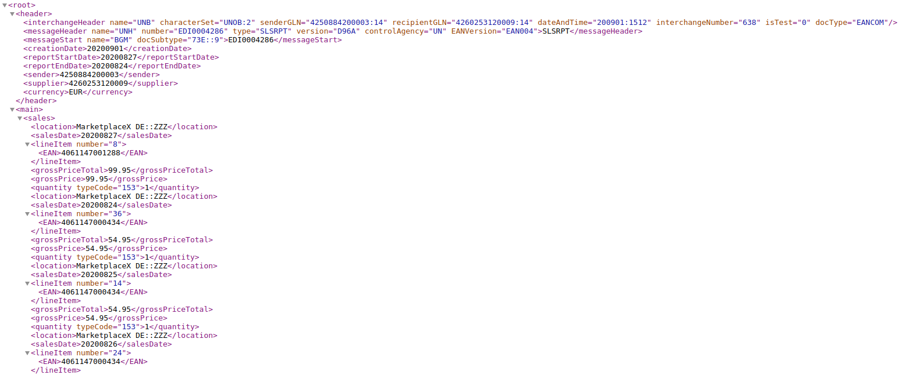

# EDI Parser

Parser, der aus Dateien im `EDIFACT` Format (Dateiendung `.edi`) eine Datei im `XML` Format generiert. Das Programm bezieht sich speziell auf die Verarbeitung von Syntax und Codes des SLSRPT-Nachrichtentyps (Sales Report). Die Input-Datei wird als Command-Line Argument übergeben. Nach der Verarbeitung wird eine `slsrpt.xml` Datei als Output generiert und ist im Projektordner verfügbar (siehe `run-script`).

## Tech Stack

- TypeScript
- Node

## Erste Schritte

### Voraussetzungen

Um die Anwendung korrekt ausführen zu können, muss TypeScript installiert sein. Entweder global z.B via

```
npm install -g typescrip
```

oder projektbasiert z.B. via

```
npm install typescript --save-dev
```

### Installation

Das Projekt kann einfach via Button geclont oder als ZIP heruntergeladen werden. Anschließend die nötigen Dependencies installieren:

```
npm install
```

### Ausführen

Die Anwendung enthält im `assets` Ordner eine Beispieldatei im `.edi` Format. Via `tsc && node src/index.js assets/SLSRPT_EXAMPLE.edi slsrpt.xml` kann sofort eine XML Beispieldatei generiert werden. Diese wird momentan im Root Ordner des Projekts gespeichert.

### Beispiel Input und Output

#### Input



#### Output



## Aufbau und Konzept der Anwendung

#### Module

- `index.ts`
- `types.ts`
- `screener.ts`
- `parser.ts`

Parsing bedeutet, die zugrundeliegende Daten-Struktur des Inputs zu finden und die Daten zur Weiterverarbeitung zu extrahieren. Aus diesem Grund besteht der vorliegende Parser aus zwei Teilen. Einem `Screener` und einem `Parser`.

### `index.ts`

Hier wird die EDI-Datei aus den Command-Line Argumenten ausgelesen, mittels Nodes File System Funktion `fs.readFile()` gelesen und zur weiteren Verarbeitung in ein String Format gebracht. Die geparsten Daten werden schließlich mittels `fs.writeFile()` in eine `slsrpt.xml` Datei geschrieben.

### `screener.ts`

Hier werden die EDI-Daten mittels standardisierter EDI-Delimiter (`'`, `+`, `:`) in Segmente , Composites und Daten-Elemente aufgeteilt. Die ausgelesenen Daten werden mit Hilfe eines `segmentObject` in eine gut auslesbare Struktur gebracht und anschließend in einer `segmentsCollection` gespeichert.

### `parser.ts`

Hier iteriert eine `parseData()` Funktion über die `segmentsCollection`, fragt Segment-Namen ab und übergibt die jeweiligen Objekt-Daten an ein XML-Snippet. Abhängig von Segment-Namen und weiterer Angaben (z.B. vorhandene "Verkauf" oder "Retoure" Composites) werden die XML-Snippets in entsprechene Arrays bzw. Collections geschoben (`headerCollection`, `salesCollection`, `returnsCollection`, `footerCollection`). Diese Collections werden dann in ein Template Literal eingefügt, welches das Grundgerüst der neuen XML-Datei bildet. `parseData()` gibt dieses als Variable `xmlData` im String-Format zurück.

## TODOS, Bugs, Probleme mit Warenwirtschaft

Der Code für diesen Parser wurde innerhalb von zwei Tagen erstellt. Nachfolgend einige Angaben zu Bugs und Funktionsweisen, die noch überarbeitet werden müssen. Außerdem Überlegungen zu Problemen beim Import der generierten Daten in ein Warenwirtschaftssystem.

- Abhängig davon, wie wichtig Daten aus dem Header einer EDI-Message z.B. für den Import in ein Warenwirtschaftssystem sind, müssen XML-Tags oder Attribute angepasst werden

- Generell gilt: Für den Import in ein Warenwirtschaftssystem müssen die generierten XML-Snipptes und gewählten Namen für XML-Tags und -Attribute angepasst werden, um alle notwendigen Feld-Daten liefern zu können

- Die verarbeitete EDI-Datei enthält Segmente, die einen abweichenden Währungscode aufweisen. In der vorliegenden Version des Parsers werden diese noch nicht separat verarbeitet, sondern mit der `salesCollection` übergeben. Dies sollte bei einer Überarbeitung noch angepasst werden.

- Der Algorithmus, der die einzelnen Daten-Elemente aus den Composites ausliest, funtioniert im Moment nur für Composites-Arrays, die lediglich ein Composite enthalten, das aus Daten-Elementen zusammengesetzt ist. Im Falle von `UNB` Segmenten, wo es mehrere solcher Composites gibt, werden die Elemente nicht richtig ausgelesen.

- Um den Parser universaler zu machen, könnte noch eine Art Regel-Sammlung für EDI-Codes bereitgestellt werden, die diese in XML-Tags o.ä. übersetzt (z.B. direkt aus `PRI+AAB` auszulesen, ob brutto oder netto Preis). Die Frage ist auch, ob ein Warenwirtschaftssystem solche EDI-Codes lesen kann, oder ob dies in anderer Form übergeben werden muss.
